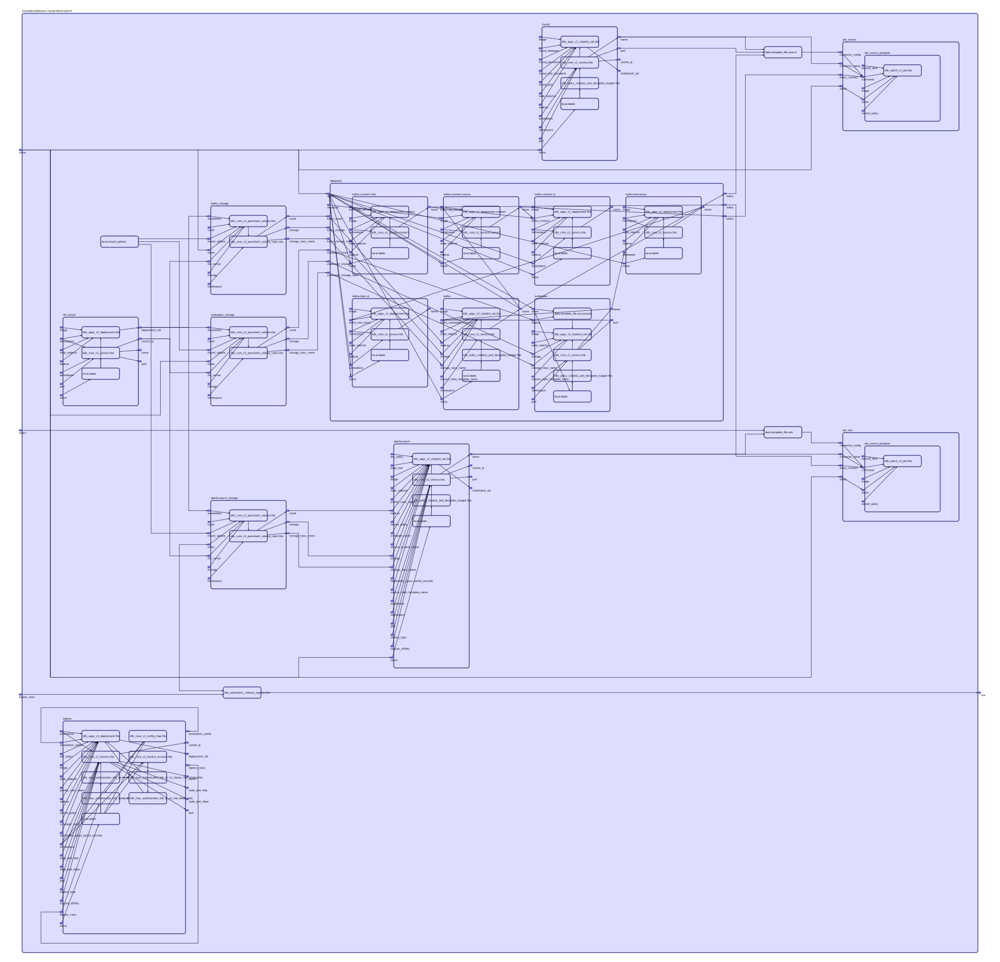

To view the full size interactive diagram, append ```?sanitize=true``` to the raw URL.

Use Debezium and Kafka Connect to sync from MySql to Elasticsearch.

Based on https://github.com/debezium/debezium-examples/tree/master/unwrap-smt

Ingress:\
You must set the ingress_host variable to the IP address of any node.\
The default will most likely not match yours.

Storage:\
The [nfs-server-empty-dir](https://github.com/mingfang/terraform-provider-k8s/tree/master/modules/nfs-server-empty-dir) module
is used for temporary storage, making the example easy to run and clean up.

Instructions:
1. Create alias to run Terraform with this Kubernetes plugin.
   ```
   alias tf='docker run -v `pwd`/kubeconfig:/kubeconfig -v `pwd`:/docker -w /docker --rm -it registry.rebelsoft.com/terraform terraform'
   ```
2. Copy the kubeconfig file for your cluster to the current directory.
3. Create a Terraform file to include this example, like this
   ```
   module "debezium-mysql-es" {
     source = "git::https://github.com/mingfang/terraform-provider-k8s.git//examples/debezium-mysql-elasticsearch"
     ingress_host = "<IP of any node, e.g. 192.168.2.146>"
   }

   output "urls" {
     value = "${module.debezium-mysql-es.urls}"
   }
   ```
4. Run init to download the modules.
   ```
   tf init
   ```
5. Run apply
   ```
   tf apply
   ```
6. The output includes a list of URLs that can be used to access Kafka and Elasticsearch.
   ```
   Outputs:

   urls = [
       http://kafka-connect-ui.192.168.2.146.nip.io:30000,
       http://kafka-topic-ui.192.168.2.146.nip.io:30000,
       http://elasticsearch.192.168.2.146.nip.io:30000
   ]
   ```
7. After a couple of minutes, you should see customer data sync from MySql to Elasticsearch.
   ```
   curl <Elasticsearch URL>/customers/_search?pretty
   ```
8. Run destory to clean up.
   ```
   tf destroy
   ```

## Inputs

| Name | Description | Type | Default | Required |
|------|-------------|:----:|:-----:|:-----:|
| ingress\_host | The IP address of any node | string | `"192.168.2.146"` | no |
| name |  | string | `"debezium-mysql-es"` | no |
| topics | comma separated list of tables to sync | string | `"customers"` | no |

## Outputs

| Name | Description |
|------|-------------|
| urls |  |

