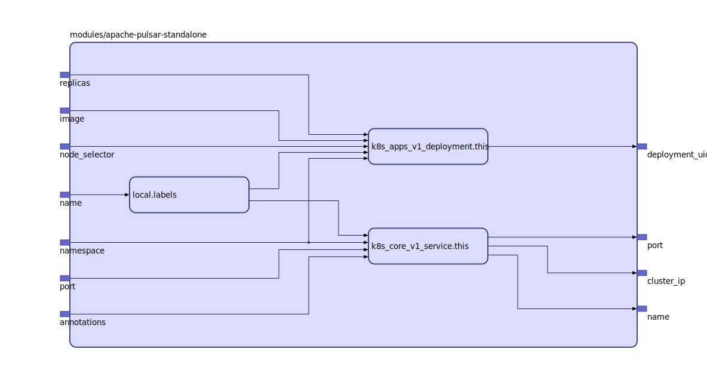

Apache Pulsar Standalone Cluster

Based on https://pulsar.apache.org/docs/en/standalone-docker/

## Inputs

| Name | Description | Type | Default | Required |
|------|-------------|:----:|:-----:|:-----:|
| name |  | string | n/a | yes |
| annotations |  | map | `{}` | no |
| image |  | string | `"apachepulsar/pulsar-all:2.2.0"` | no |
| namespace |  | string | `"default"` | no |
| node\_selector |  | map | `{}` | no |
| port |  | string | `"6650"` | no |
| replicas |  | string | `"1"` | no |

## Outputs

| Name | Description |
|------|-------------|
| cluster\_ip |  |
| deployment\_uid |  |
| name |  |
| port |  |

