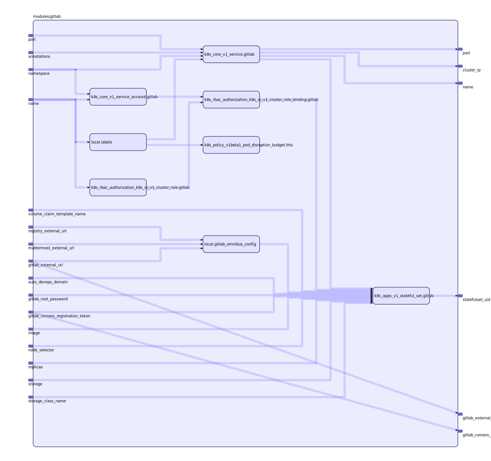

Documentation

terraform-docs --sort-inputs-by-required --with-aggregate-type-defaults md

## Inputs

| Name | Description | Type | Default | Required |
|------|-------------|:----:|:-----:|:-----:|
| auto\_devops\_domain |  | string | n/a | yes |
| gitlab\_external\_url |  | string | n/a | yes |
| gitlab\_root\_password |  | string | n/a | yes |
| gitlab\_runners\_registration\_token |  | string | n/a | yes |
| mattermost\_external\_url |  | string | n/a | yes |
| name |  | string | n/a | yes |
| registry\_external\_url |  | string | n/a | yes |
| storage |  | string | n/a | yes |
| storage\_class\_name |  | string | n/a | yes |
| annotations |  | map | `{}` | no |
| image |  | string | `"gitlab/gitlab-ee:latest"` | no |
| namespace |  | string | `""` | no |
| node\_selector |  | map | `{}` | no |
| port |  | string | `"80"` | no |
| replicas |  | string | `"1"` | no |
| volume\_claim\_template\_name |  | string | `"pvc"` | no |

## Outputs

| Name | Description |
|------|-------------|
| cluster\_ip |  |
| gitlab\_external\_url |  |
| gitlab\_runners\_registration\_token |  |
| name |  |
| port |  |
| statefulset\_uid |  |

