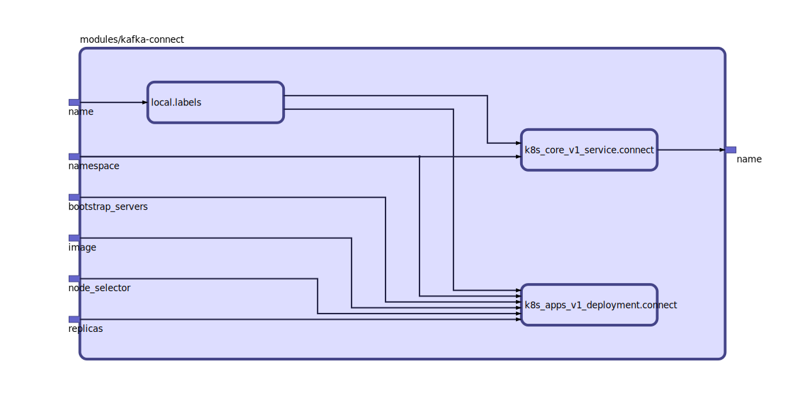

## Inputs

| Name | Description | Type | Default | Required |
|------|-------------|:----:|:-----:|:-----:|
| bootstrap\_servers |  | string | n/a | yes |
| name |  | string | n/a | yes |
| image |  | string | `"debezium/connect"` | no |
| namespace |  | string | `"default"` | no |
| node\_selector |  | map | `{}` | no |
| replicas |  | string | `"1"` | no |

## Outputs

| Name | Description |
|------|-------------|
| name |  |

