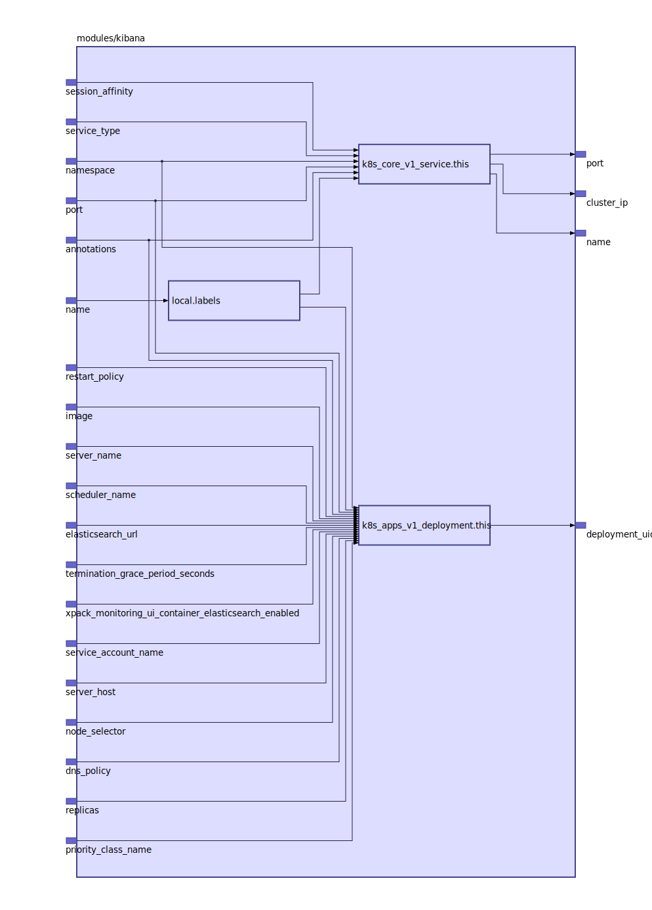

To view the full size interactive diagram, append ```?sanitize=true``` to the raw URL.

[Kibana](https://www.elastic.co/products/kibana)

## Inputs

| Name | Description | Type | Default | Required |
|------|-------------|:----:|:-----:|:-----:|
| annotations |  | map | `{}` | no |
| dns\_policy |  | string | `""` | no |
| elasticsearch\_url |  | string | `"http://elasticsearch:9200"` | no |
| image |  | string | `"docker.elastic.co/kibana/kibana:6.5.1"` | no |
| name |  | string | `"kibana"` | no |
| namespace |  | string | `""` | no |
| node\_selector |  | map | `{}` | no |
| port |  | string | `"5601"` | no |
| priority\_class\_name |  | string | `""` | no |
| replicas |  | string | `"1"` | no |
| restart\_policy |  | string | `""` | no |
| scheduler\_name |  | string | `""` | no |
| server\_host |  | string | `"0.0.0.0"` | no |
| server\_name |  | string | `"kibana"` | no |
| service\_account\_name |  | string | `""` | no |
| service\_type |  | string | `""` | no |
| session\_affinity |  | string | `""` | no |
| termination\_grace\_period\_seconds |  | string | `"30"` | no |
| xpack\_monitoring\_ui\_container\_elasticsearch\_enabled |  | string | `"true"` | no |

## Outputs

| Name | Description |
|------|-------------|
| cluster\_ip |  |
| deployment\_uid |  |
| name |  |
| port |  |

