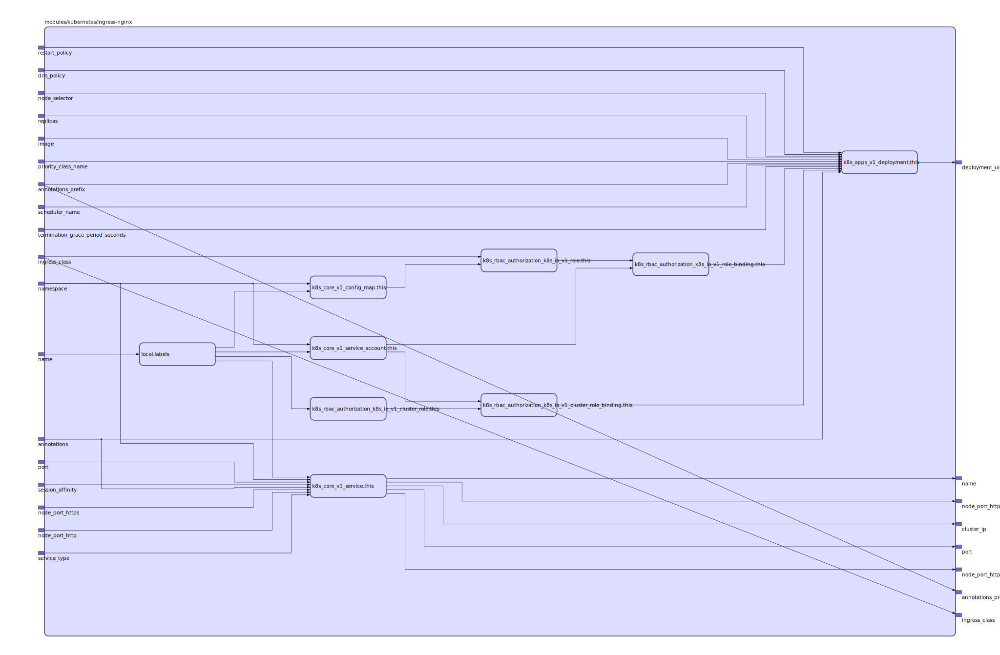

[Nginx Ingress Controller](https://kubernetes.github.io/ingress-nginx/)

Based on https://github.com/kubernetes/ingress-nginx/blob/master/deploy/mandatory.yaml

## Inputs

| Name | Description | Type | Default | Required |
|------|-------------|:----:|:-----:|:-----:|
| annotations |  | map | `{}` | no |
| annotations\_prefix |  | string | `"nginx.ingress.kubernetes.io"` | no |
| dns\_policy |  | string | `""` | no |
| image |  | string | `"quay.io/kubernetes-ingress-controller/nginx-ingress-controller:0.21.0"` | no |
| name |  | string | `"ingress-nginx"` | no |
| namespace |  | string | `"default"` | no |
| node\_port\_http |  | string | `"30000"` | no |
| node\_port\_https |  | string | `"30443"` | no |
| node\_selector |  | map | `{}` | no |
| port |  | string | `"80"` | no |
| priority\_class\_name |  | string | `""` | no |
| replicas |  | string | `"1"` | no |
| restart\_policy |  | string | `""` | no |
| scheduler\_name |  | string | `""` | no |
| service\_type |  | string | `"NodePort"` | no |
| session\_affinity |  | string | `""` | no |
| termination\_grace\_period\_seconds |  | string | `"30"` | no |

## Outputs

| Name | Description |
|------|-------------|
| annotations\_prefix |  |
| cluster\_ip |  |
| deployment\_uid |  |
| name |  |
| node\_port\_http |  |
| node\_port\_https |  |
| port |  |

