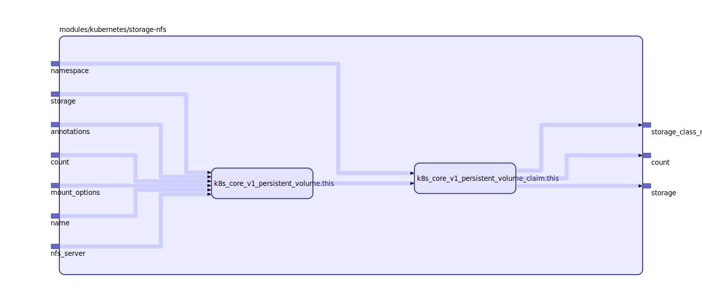

To view the full size interactive diagram, append ```?sanitize=true``` to the raw URL.

Create a set of PersistentVolumes and a coresponding set of PersistentVolumeClaims.

Useful for used with the VolumeClaimTemplates of StatefulSets.

## Inputs

| Name | Description | Type | Default | Required |
|------|-------------|:----:|:-----:|:-----:|
| count |  | string | n/a | yes |
| name |  | string | n/a | yes |
| nfs\_server |  | string | n/a | yes |
| storage |  | string | n/a | yes |
| annotations |  | map | `{}` | no |
| mount\_options |  | list | `[]` | no |
| namespace |  | string | `""` | no |

## Outputs

| Name | Description |
|------|-------------|
| count |  |
| storage |  |
| storage\_class\_name |  |

