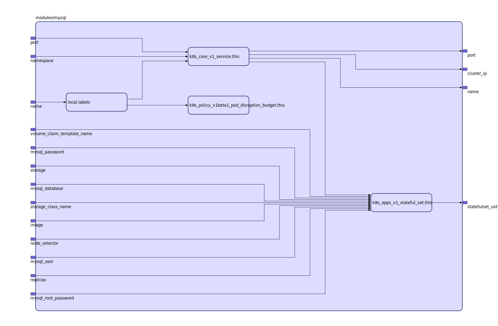

To view the full size interactive diagram, append ```?sanitize=true``` to the raw URL.

## Inputs

| Name | Description | Type | Default | Required |
|------|-------------|:----:|:-----:|:-----:|
| mysql\_database |  | string | n/a | yes |
| mysql\_password |  | string | n/a | yes |
| mysql\_root\_password |  | string | n/a | yes |
| mysql\_user |  | string | n/a | yes |
| name |  | string | n/a | yes |
| storage |  | string | n/a | yes |
| storage\_class\_name |  | string | n/a | yes |
| image |  | string | `"mysql"` | no |
| namespace |  | string | `"default"` | no |
| node\_selector |  | map | `{}` | no |
| port |  | string | `"3306"` | no |
| replicas |  | string | `"1"` | no |
| volume\_claim\_template\_name |  | string | `"pvc"` | no |

## Outputs

| Name | Description |
|------|-------------|
| cluster\_ip |  |
| name |  |
| port |  |
| statefulset\_uid |  |

