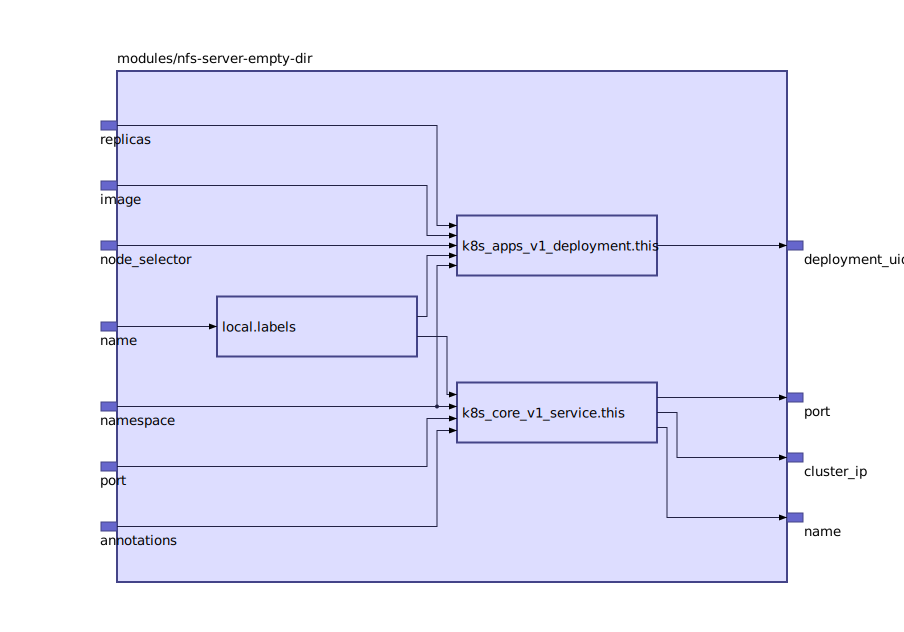

Runs a NFS Server serving from an empheral empty dir.

WARNING: For demonstration purpose only; You will loose data.

Based on https://github.com/kubernetes/examples/tree/master/staging/volumes/nfs

## Inputs

| Name | Description | Type | Default | Required |
|------|-------------|:----:|:-----:|:-----:|
| name |  | string | n/a | yes |
| annotations |  | map | `{}` | no |
| image |  | string | `"itsthenetwork/nfs-server-alpine"` | no |
| medium | Set to Memory to use tmpfs | string | `""` | no |
| namespace |  | string | `"default"` | no |
| node\_selector |  | map | `{}` | no |
| port |  | string | `"2049"` | no |
| replicas |  | string | `"1"` | no |

## Outputs

| Name | Description |
|------|-------------|
| cluster\_ip |  |
| deployment\_uid |  |
| name |  |
| port |  |

