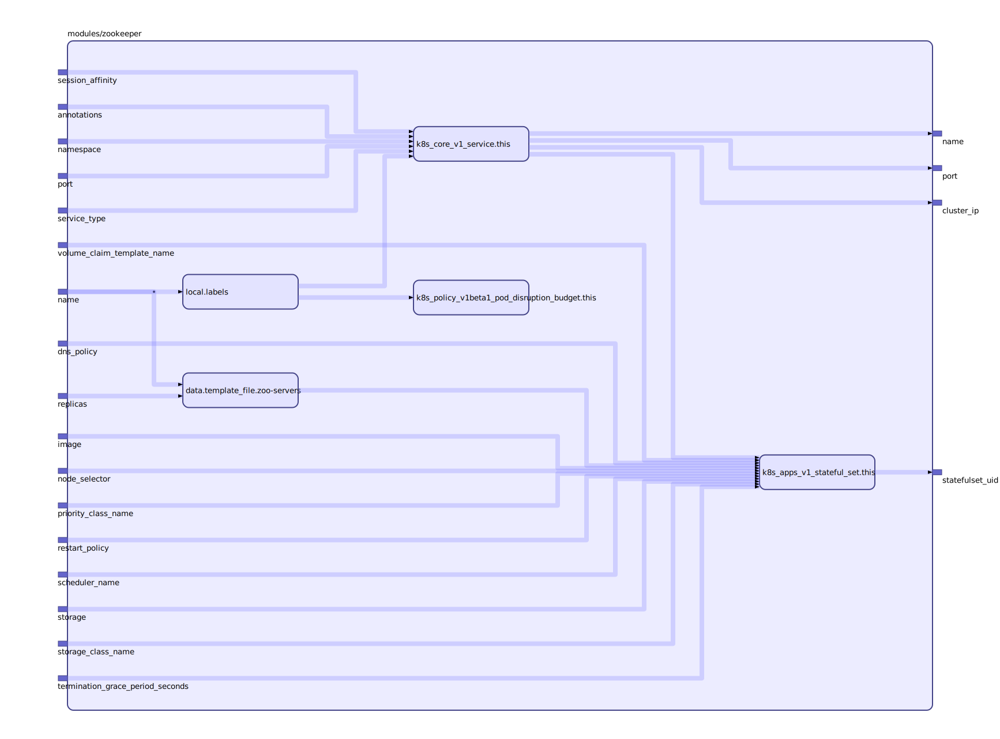

To view the full size interactive diagram, append ```?sanitize=true``` to the raw URL.

Module usage:

    module "zookeeper" {
      source             = "git::https://github.com/mingfang/terraform-provider-k8s.git//modules/zookeeper"
      name               = "test-zookeeper"
      storage_class_name = "test-zookeeper"
      storage            = "100Gi"
      replicas           = "${k8s_core_v1_persistent_volume.test-zookeeper.count}"
    }

    resource "k8s_core_v1_persistent_volume" "test-zookeeper" {
      count = 3

      metadata {
        name = "pvc-test-zookeeper-${count.index}"
      }

      spec {
        storage_class_name               = "test-zookeeper"
        persistent_volume_reclaim_policy = "Retain"
        access_modes                     = ["ReadWriteOnce"]

        capacity {
          storage = "100Gi"
        }

        cephfs {
          user = "admin"

          monitors = [
            "192.168.2.89",
            "192.168.2.39",
          ]

          secret_ref {
            name      = "ceph-secret"
            namespace = "default"
          }
        }
      }
    }

## Inputs

| Name | Description | Type | Default | Required |
|------|-------------|:----:|:-----:|:-----:|
| name |  | string | n/a | yes |
| storage |  | string | n/a | yes |
| storage\_class\_name |  | string | n/a | yes |
| annotations |  | map | `{}` | no |
| dns\_policy |  | string | `""` | no |
| image |  | string | `"zookeeper"` | no |
| namespace |  | string | `""` | no |
| node\_selector |  | map | `{}` | no |
| port |  | string | `"2181"` | no |
| priority\_class\_name |  | string | `""` | no |
| replicas |  | string | `"1"` | no |
| restart\_policy |  | string | `""` | no |
| scheduler\_name |  | string | `""` | no |
| service\_type |  | string | `""` | no |
| session\_affinity |  | string | `""` | no |
| termination\_grace\_period\_seconds |  | string | `"30"` | no |
| volume\_claim\_template\_name |  | string | `"pvc"` | no |

## Outputs

| Name | Description |
|------|-------------|
| cluster\_ip |  |
| name |  |
| port |  |
| statefulset\_uid |  |

