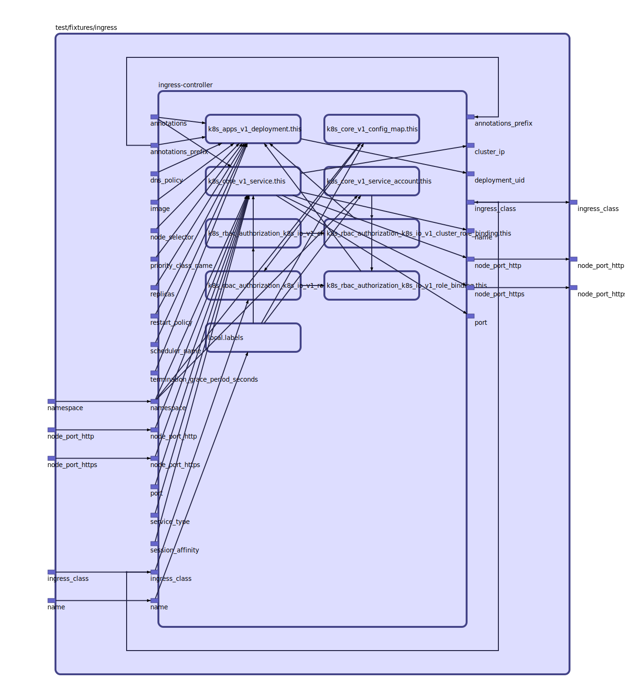

## Inputs

| Name | Description | Type | Default | Required |
|------|-------------|:----:|:-----:|:-----:|
| name |  | string | n/a | yes |
| node\_port\_http |  | string | `"30080"` | no |
| node\_port\_https |  | string | `"30081"` | no |

## Outputs

| Name | Description |
|------|-------------|
| node\_port\_http |  |
| node\_port\_https |  |

