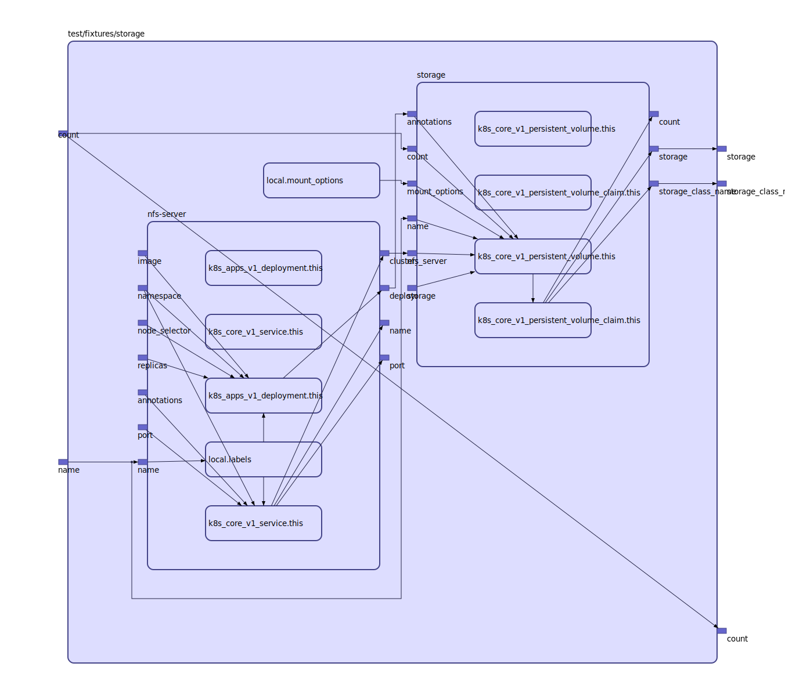

## Inputs

| Name | Description | Type | Default | Required |
|------|-------------|:----:|:-----:|:-----:|
| count |  | string | n/a | yes |
| name |  | string | n/a | yes |
| namespace |  | string | n/a | yes |

## Outputs

| Name | Description |
|------|-------------|
| count |  |
| storage |  |
| storage\_class\_name |  |

