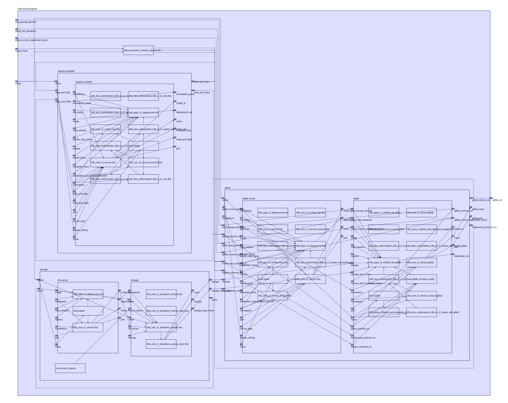

To view the full size interactive diagram, append ```?sanitize=true``` to the raw URL.

go test -v test/solutions/gitlab/basic_test.go

## Inputs

| Name | Description | Type | Default | Required |
|------|-------------|:----:|:-----:|:-----:|
| auto\_devops\_domain |  | string | `"1.2.3.4.nip.io"` | no |
| gitlab\_root\_password |  | string | `"changeme"` | no |
| gitlab\_runners\_registration\_token |  | string | `"wMFs1-9kpfMeKsfKsNFQ"` | no |
| ingress\_host |  | string | `"192.168.2.146"` | no |
| name |  | string | `"test-gitlab"` | no |

## Outputs

| Name | Description |
|------|-------------|
| gitlab\_url |  |

